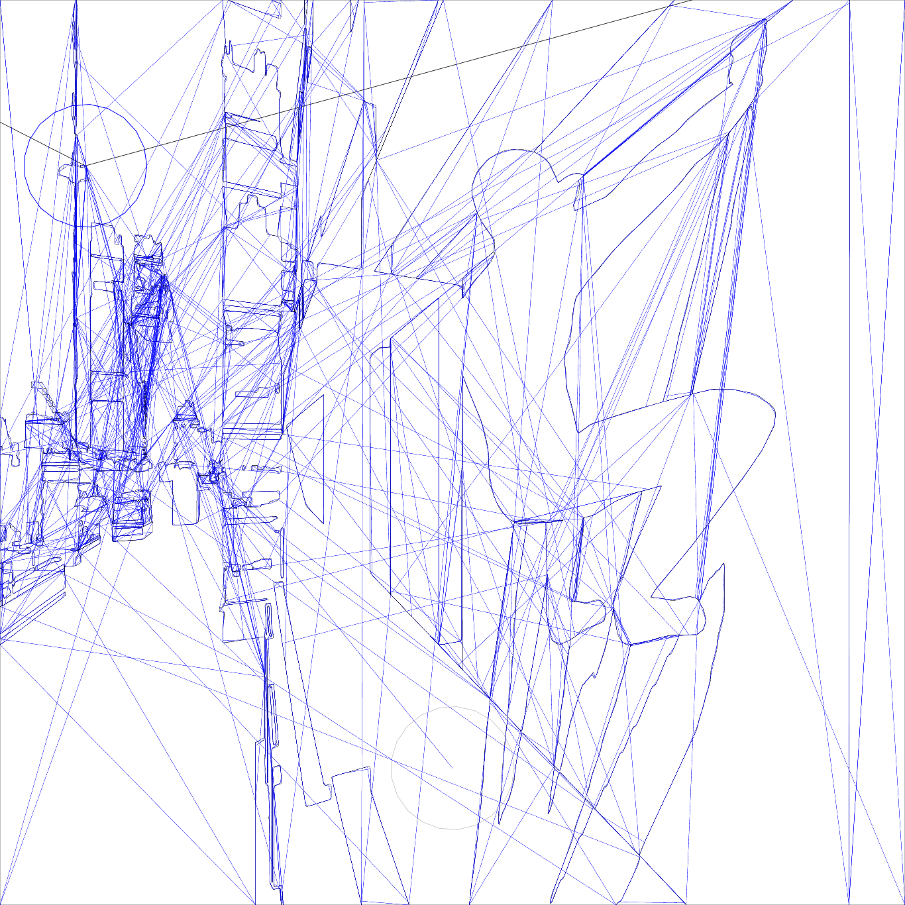
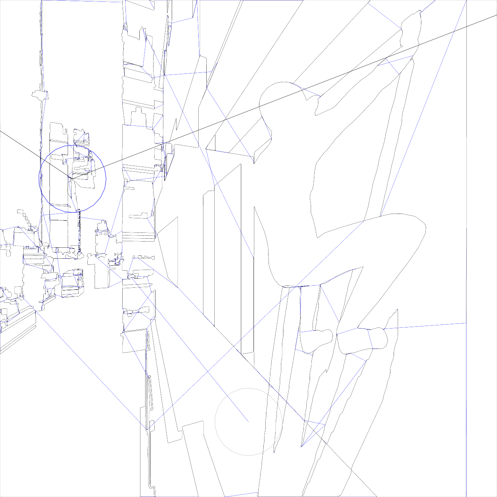

makelangelo-optimizer
====================

Optimize drawing plan for the Makelangelo vertical plotter.
Originally designed for [Polargraph](http://polargraph.co.uk) machines.
Now patched to work with G-code exported from [Makelangelo software](https://github.com/MarginallyClever/Makelangelo-software).

Before
----



After
----



Example Usage
----

Optimize the included drawing plan `test.ngc`:

```
$ time ./process.py test.ngc > test_optimized.ngc
Total Glyphs: 13
Initial penup distance:      7020
Initial total distance:      9542
Deduped penup distance:      7020
Deduped total distance:      9542
Sorted penup distance:       3470
Sorted total distance:       5992
Greedy penup (i=0)            147
Greedy total (i=0)           2669
Total instructions:           196
Pruned instructions:          184
Clean instructions:          168

real	0m0.130s
user	0m0.057s
sys	0m0.065s
```

Now `test_optimized.ngc` includes a reordered drawing plan with duplicate glyphs removed and with an improved ordering.

About the algorithm
----

The optimization algorithm is basically this:

  * Remove path sections which are exact duplicates of earlier sections
  * Reorder paths:
    * Pick the first path as the first path in the input file
    * Find the path that starts nearest the previous one's endpoint, or the one which, if reversed, would start nearest the previous one's endpoint
    * Repeat until we have processed all paths

With some very inefficiently ordered SVG files, exported from Adobe Illustrator, I've seen drawing times go down from over 4 hours to as little as 20 minutes.

Compatibility
----

Confirmed working with G-code exported from Makelangelo version 7.23.0. Not tested with multicolor (CMYK) modes.

Contributors
----

[Jip de Beer](https://github.com/Jip-Hop)

[Evan Heidtmann](https://github.com/ezheidtmann)

[Olivier Bouwman](https://github.com/olivierbouwman)
